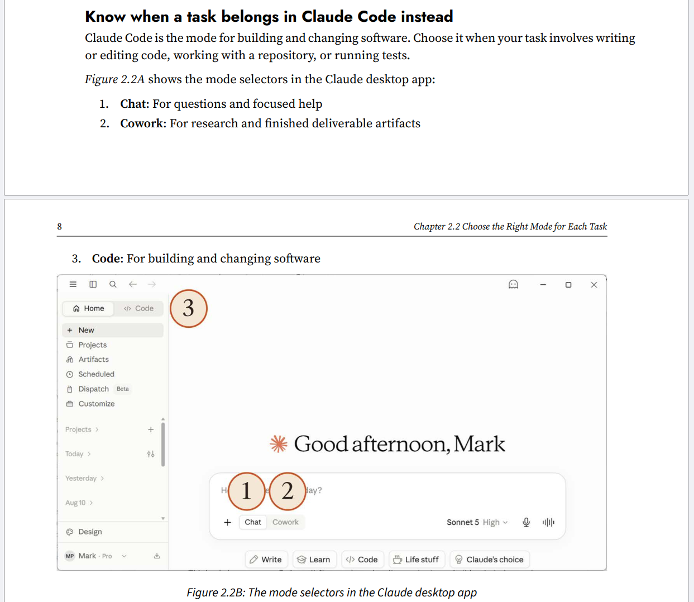
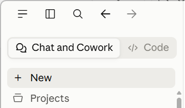

- [Chapter 1.4 Have Your First Useful Conversation by Typing, Talking, or Showing](#chapter-14-have-your-first-useful-conversation-by-typing-talking-or-showing)
  - [Select a model and effort level](#select-a-model-and-effort-level)
- [Chapter 2.2 Choose the Right Mode for Each Task](#chapter-22-choose-the-right-mode-for-each-task)
  - [Figure 2.2B: The mode selectors in the Claude desktop app](#figure-22b-the-mode-selectors-in-the-claude-desktop-app)

# Chapter 1.4 Have Your First Useful Conversation by Typing, Talking, or Showing

## Select a model and effort level

Here's a table of Claude models and versions that were released from October 2025 to September 2026 and notes about why they are relevant:

| Date | Model | Tier | Notes |
|---|---|---|---|
| October 15, 2025 | Haiku 4.5 | Haiku | Currently the small/fast tier model. |
| Apr 16, 2026 | Opus 4.7 | Opus | Point release ahead of the 4.8 update. Note the six-week gap between minor point releases (4.7 to 4.8). |
| May 28, 2026 | Opus 4.8 | Opus | Anthropic called it a "modest but tangible" improvement over 4.7, with a focus on reducing unsupported claims/overconfidence; same pricing as 4.7. |
| Jun 9, 2026 | Fable 5 & Mythos 5 | Mythos | First "Mythos-class" models. Fable 5 is the generally available version with added safety classifiers for cybersecurity/biology/model-distillation topics; Mythos 5 is the same underlying model without those extra guardrails, limited to vetted orgs via Project Glasswing. |
| Jun 30, 2026 | Sonnet 5 | Sonnet | Became the new default model for Free and Pro plans; pitched as "the most agentic Sonnet," with performance closer to Opus-class at Sonnet pricing. |
| Jul 24, 2026 | Opus 5 | Opus | Described as coming close to Fable 5's frontier intelligence at roughly half the price; became the default model on Claude Max. |
| Sep 1, 2026 | Fable 5.1 & Mythos 5.1 | Mythos | Fable 5.1 is generally available; Mythos 5.1 is invite-only for vetted cybersecurity/life-sciences organizations. Headline pricing unchanged. |

# Chapter 2.2 Choose the Right Mode for Each Task

## Figure 2.2B: The mode selectors in the Claude desktop app

In the print book, the mode selector uses **Home**, as shown in *Figure 2.2B*:

The newer version of Claude uses **Chat and Cowork** instead:

