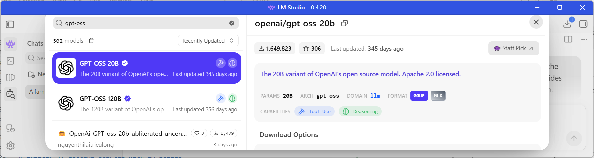
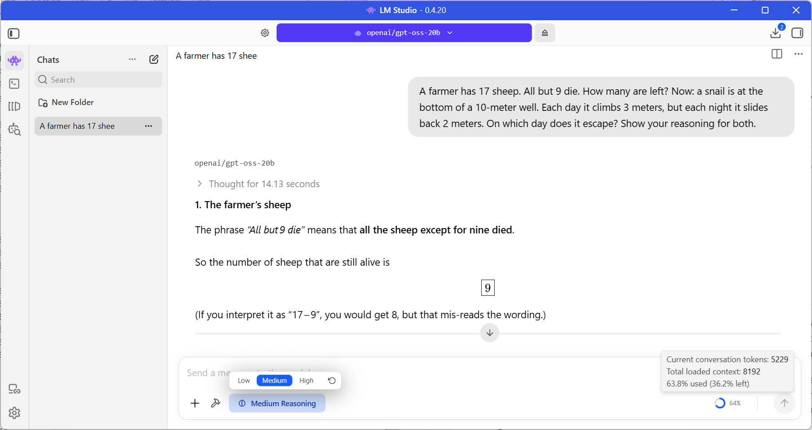
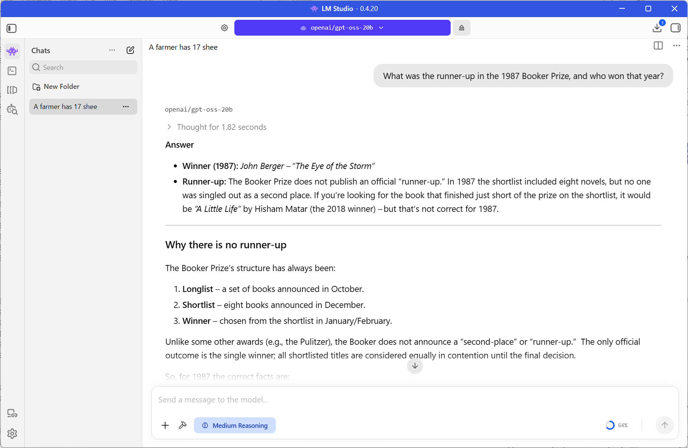
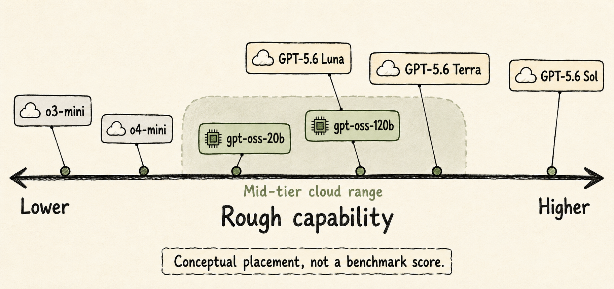
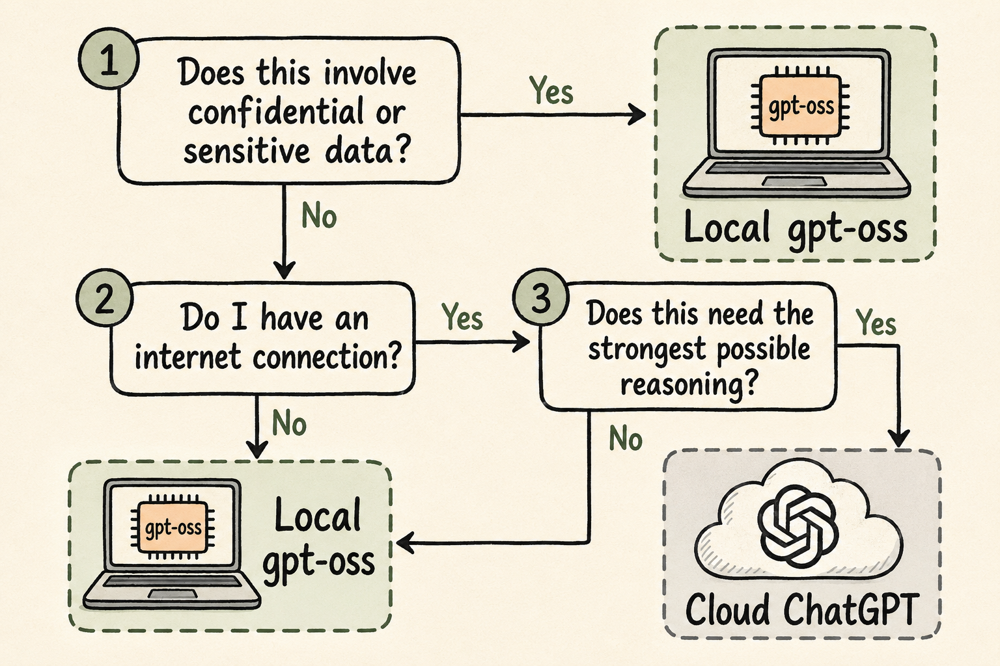

> **A free bonus online-only guide to the *ChatGPT Visual Bible*, not included in the print edition**


*Technical details in this guide were last verified against primary sources in August 2026. Local AI tools change quickly. Confirm current requirements before relying on any of them.*

- [Introduction](#introduction)
- [Chapter 1: Why run an AI model on your own hardware](#chapter-1-why-run-an-ai-model-on-your-own-hardware)
  - [What local AI actually means](#what-local-ai-actually-means)
  - [Removing the safety behavior](#removing-the-safety-behavior)
    - [What "uncensored" and "abliterated" actually mean](#what-uncensored-and-abliterated-actually-mean)
    - [Genuine reasons people want one](#genuine-reasons-people-want-one)
    - [How to find a suitable model](#how-to-find-a-suitable-model)
  - [Try it now](#try-it-now)
    - [Check the result](#check-the-result)
- [Chapter 2: Meet `gpt-oss-20b` and `gpt-oss-120b`](#chapter-2-meet-gpt-oss-20b-and-gpt-oss-120b)
  - [What "open-weight" means](#what-open-weight-means)
  - [How the two models differ](#how-the-two-models-differ)
  - [Context windows](#context-windows)
  - [Try it now](#try-it-now-1)
    - [Check the result](#check-the-result-1)
- [Chapter 3: The hardware these models need](#chapter-3-the-hardware-these-models-need)
  - [`gpt-oss-20b`: the practical everyday choice](#gpt-oss-20b-the-practical-everyday-choice)
  - [`gpt-oss-120b`: possible, but hardware-hungry](#gpt-oss-120b-possible-but-hardware-hungry)
  - [Try it now](#try-it-now-2)
    - [Check the result](#check-the-result-2)
- [Chapter 4: Getting started with LM Studio](#chapter-4-getting-started-with-lm-studio)
  - [The basic workflow](#the-basic-workflow)
  - [Try it now](#try-it-now-3)
    - [Check the result](#check-the-result-3)
- [Chapter 5: How gpt-oss compares to cloud models](#chapter-5-how-gpt-oss-compares-to-cloud-models)
  - [Clearing up the naming confusion](#clearing-up-the-naming-confusion)
  - [Where gpt-oss fits](#where-gpt-oss-fits)
  - [Try it now](#try-it-now-4)
    - [Check the result](#check-the-result-4)
- [Chapter 6: What local models are best used for](#chapter-6-what-local-models-are-best-used-for)
  - [Strong local use cases](#strong-local-use-cases)
  - [Where the cloud still wins](#where-the-cloud-still-wins)
  - [Try it now](#try-it-now-5)
    - [Check the result](#check-the-result-5)
- [Chapter 7: Mixing local and cloud models](#chapter-7-mixing-local-and-cloud-models)
  - [Patterns worth adopting](#patterns-worth-adopting)
  - [Try it now](#try-it-now-6)
    - [Check the result](#check-the-result-6)

# Introduction

*Book 1* to *Book 4* taught you to work with ChatGPT running in OpenAI's cloud. Every request leaves your device, gets answered by a model running on OpenAI's servers, and comes back. That is the right setup for almost everything you do day to day.

This guide covers the other path: running an AI model entirely on your own laptop or desktop, with nothing leaving your device. OpenAI itself makes this possible through two open-weight models, `gpt-oss-20b` and `gpt-oss-120b`, which you can download once and run as many times as you like, offline, for free.

But don't get too excited just yet! Running OpenAI's models locally is quite a different experience and they have much more limited capabilities. They have their place but put away the idea that you can avoid using cloud models. Cloud models will likely always be superior to local models in most respects. This guide is about knowing those special situations when a local model is the better tool: when privacy matters more than raw capability, when you have no internet connection, or when you want to experiment with owning the whole stack yourself.

Two machines run as the worked examples throughout this guide: a Windows laptop with an NVIDIA RTX 5090 Mobile GPU (24GB of VRAM) and a MacBook Pro with an M1 Max chip (64GB of unified memory). If your own hardware differs, the same principles apply; only the exact numbers change.

# Chapter 1: Why run an AI model on your own hardware

## What local AI actually means

A cloud AI model like ChatGPT runs on a server you never see, owned by OpenAI. A local AI model runs entirely on your own computer's processor and memory. Once you have downloaded the model file, once, your device does not need to contact any server to generate a response.

This gives some key benefits:

1. **Privacy and confidentiality.** Nothing you type into a local model leaves your device. For most everyday writing this does not matter much. It matters a great deal for the confidentiality duties covered in this series' *Profession-Specific Prompts* bonus book: a lawyer drafting from real case facts, a therapist working with session notes, or a healthcare worker handling patient details all have a genuine reason to prefer a tool that never transmits their input anywhere.

2. **Working offline**. A local model keeps working on a plane, in a basement server room, at a remote job site, or anywhere else your internet connection is slow or absent. ChatGPT cannot respond at all without a connection; a local model does not know the difference.

3. **Cost at high volume**. A local model has no per-message or per-token charge once you own the hardware. If you run thousands of requests a day, for a batch task or an automated workflow, the cost is electricity, not a subscription or API bill. For occasional personal use, a paid ChatGPT plan is still cheaper than buying a capable GPU solely for this purpose.

4. **Control and customization**. Because gpt-oss is released under the Apache 2.0 license, one of the most permissive open-source licenses available, you may inspect, modify, and even fine-tune the model on your own data, something no cloud-only model permits. You also control exactly which version you run and when it changes, rather than having updates applied to your account automatically.

## Removing the safety behavior

Every major hosted AI product ships with guardrails: a layer of safety training and moderation that refuses certain requests outright, softens others, or routes them to a canned response. For most everyday use, that's a sensible default. But a growing number of users, especially people running models locally, deliberately seek out versions with those guardrails removed or reduced. This section explains what that means, why people want it, and how to find a suitable model responsibly.

### What "uncensored" and "abliterated" actually mean

These two terms get used loosely, but they describe different things.

An **uncensored model** is usually a base or fine-tuned model that was trained, or retrained, without the additional safety-alignment pass most commercial labs apply on top of a raw language model. That safety pass is what teaches a model to refuse certain topics, hedge on others, and avoid content the provider considers reputationally risky. Skipping or reversing it produces a model that behaves closer to its unfiltered training data.

**Abliteration** is a more specific technique. Researchers found that a model's tendency to refuse a request corresponds to a fairly consistent internal "direction" in its activation space, a pattern the model has learned to associate with declining. Abliteration identifies that direction and mathematically suppresses it, without a full retraining run. The result is a model that keeps most of its original capability but stops reflexively refusing. It's a form of targeted surgery on the weights rather than a new training process, which is why it's become popular for adapting existing open-weight models: it's cheap, fast, and doesn't require the original training data.

Both approaches sit on a spectrum. Some models are lightly de-censored (fewer topic refusals, same underlying safety judgment); others are stripped close to raw, with few or no built-in refusals at all. Model cards usually say which.

### Genuine reasons people want one

The demand isn't limited to a single use case, and several of the most common ones are entirely legitimate.

**Adult fiction and role-play.** Commercial chat products routinely refuse or sanitize romantic, sexual, or violent content even in a clearly fictional, consensual, adults-only context, because moderation systems are tuned for the average case, not the specific one. Novelists, game masters, and interactive-fiction writers who want a collaborator that can sustain mature themes without breaking character or lecturing them mid-scene often move to an uncensored local model for exactly that reason.

**Overcautious refusals on ordinary topics.** Safety tuning is blunt. It frequently blocks or hedges requests that have nothing to do with real harm: historical accounts of violence, medical or legal detail a professional needs precisely, security research, dark humor, or simply a direct opinion on a controversial question. Users doing legitimate professional or academic work report the refusal rate on benign requests as the single biggest frustration with heavily aligned models.

**Jurisdictional and political restrictions.** Some hosted models apply content policies shaped by the laws or political sensitivities of the country the provider operates in or serves, restricting discussion of certain historical events, political figures, or state actions. A user in a different jurisdiction, where that speech is legal and normal, may reasonably want a model that doesn't inherit restrictions written for someone else's regulatory environment.

**Privacy and independence from corporate moderation.** Some users simply don't want a third party logging, reviewing, or shaping their conversations at all, on any topic. Running an open-weight model locally, uncensored or not, keeps the interaction entirely off a company's servers.

**Research, red-teaming, and model evaluation.** Safety researchers and AI developers deliberately study uncensored and abliterated models to understand what alignment training does and doesn't remove, and to test whether safety behavior generalizes or is superficial. This is a recognized and published area of interpretability research, not a fringe activity.

**Creative and technical experimentation.** Fiction writers exploring morally complex characters, game developers wanting NPC dialogue that isn't visibly "AI-safe," and hobbyists customizing a personal assistant all have reasons to want a model that follows their instructions rather than a third party's content policy.

None of this erases the other side of the coin: the same guardrails that block a legitimate novelist also block someone trying to generate real harassment, exploitation material, or dangerous instructions, and abliteration removes that resistance too. The responsibility for what gets generated with an uncensored model sits entirely with the user, not with any built-in safety net. 

> **Watch out**: Removing a model's refusals doesn't remove the law: content that's illegal to produce, possess, or distribute stays illegal regardless of what model produced it.

### How to find a suitable model

**Hugging Face is the primary catalog.** Search the model hub for the terms "uncensored" or "abliterated"; both have become de facto tags that creators use in the model name itself (for example, a model card named `Llama-3-8B-Instruct-abliterated`). Filtering by these keywords surfaces community fine-tunes built specifically for this purpose, layered on top of well-known open-weight bases such as Llama, Mistral, Qwen, or Gemma.

**Read the model card before downloading anything.** A good card states what was done (full retrain, LoRA fine-tune, or abliteration), which base model it started from, what benchmarks were run afterward to check the model didn't lose general capability, and what the maintainer's own content stance is.

**Check community boards for real-world track record.** Communities such as `r/LocalLLaMA` on Reddit, and Discord servers built around specific inference tools, regularly discuss which uncensored fine-tunes currently perform well versus which have degraded reasoning ability as a side effect of the de-censoring process. This matters because heavy-handed abliteration can measurably hurt a model's coherence and instruction-following, not just its refusals; the community consensus on quality shifts as new releases come out, so a forum search close to your actual read date is more reliable than any static list.

**Prefer maintainers with a track record.** A handful of individuals and small groups (visible on Hugging Face by username) have built a reputation specifically for careful abliteration and uncensored fine-tuning work, publishing their methodology and before/after benchmark comparisons. Models from a known, repeat contributor with transparent documentation are generally a safer bet than an anonymous one-off upload.

> **Watch out:** An open-weight model can also be modified by anyone else, including to remove the safety behavior OpenAI built in. Treat a gpt-oss model you download from an unfamiliar source with the same caution you would apply to any other executable file, and prefer official or well-known distribution channels.

> **Good practice:** Match the tool to the task. Use a local model when privacy, offline access, or cost at scale genuinely matter for what you are doing, and keep using ChatGPT for everything else, since it remains the more capable assistant on most tasks.

## Try it now

Write down one recurring task where sending your input to a cloud server gives you pause, even briefly. Keep it in mind as you read the rest of this guide.

### Check the result
- [ ] Can you name a specific task where privacy, offline access, or volume genuinely changes which tool you would choose?
- [ ] Do you understand that a local model trades some capability for that control?

# Chapter 2: Meet `gpt-oss-20b` and `gpt-oss-120b`

## What "open-weight" means

OpenAI released `gpt-oss-20b` and `gpt-oss-120b` in August 2025 under the Apache 2.0 license. "Open-weight" means the trained model files themselves are free to download, run, and modify; it does not mean the training data or process is public, only the finished model. This is different from ChatGPT, where you can only access the model through OpenAI's app or API.

## How the two models differ

Both models use a mixture-of-experts (MoE) design. Instead of one enormous network processing every request, the model holds many smaller specialist sub-networks, called experts, and a router picks only a handful of them for each piece of text it processes. 

This is why a 120-billion-parameter model can run acceptably on far less hardware than its total size implies: `gpt-oss-120b` holds 117 billion parameters in total but activates only about 5.1 billion of them for any given token, and `gpt-oss-20b` holds 21 billion total while activating about 3.6 billion.


*Figure 1: `gpt-oss-20b` and `gpt-oss-120b` are both mixture-of-experts (MoE) models*

## Context windows

Both models support context windows up to 128,000 tokens, roughly 100,000 words, and both let you set a reasoning effort of low, medium, or high in the system prompt. A higher setting makes the model think through more steps before answering, which improves accuracy on hard problems at the cost of a slower response. This reasoning-effort setting is a property of the gpt-oss models themselves, not a separate model tier; it is easy to confuse with OpenAI's cloud model names, so in *Chapter 4* we will look into this in more depth.

> **Good practice:** Start with gpt-oss-20b even if your hardware could technically run the 120b version. It is faster, uses far less memory, and is close enough to gpt-oss-120b in everyday quality that the gap rarely matters outside of hard reasoning tasks.

> **Learn more online:** OpenAI's own gpt-oss announcement and model cards are at [openai.com/index/introducing-gpt-oss](https://openai.com/index/introducing-gpt-oss/).

## Try it now

Before downloading anything, decide which of the two models fits your hardware using *Chapter 3*, so you do not spend an evening downloading a 120b model your machine cannot run well.

### Check the result
- [ ] Can you explain in one sentence what "mixture of experts" means?
- [ ] Do you know the difference between `gpt-oss-20b` and `gpt-oss-120b` in your own words?

# Chapter 3: The hardware these models need

## `gpt-oss-20b`: the practical everyday choice

`gpt-oss-20b` is designed to run within about 16GB of memory thanks to native 4-bit (MXFP4) quantization, a technique that compresses the model's numbers to take up less space with only a small accuracy cost. Both of this guide's example machines handle it comfortably:

- On the Windows laptop's RTX 5090 Mobile GPU (24GB of VRAM), the entire model fits on the graphics card with room to spare, giving fast, fluid responses.
- On the MacBook Pro's M1 Max (64GB of unified memory, shared between the CPU and GPU), the model also fits easily, since Apple Silicon can dedicate a large share of its unified memory to a single application.

## `gpt-oss-120b`: possible, but hardware-hungry

OpenAI engineered `gpt-oss-120b` to run on a single 80GB data-center GPU, such as an NVIDIA H100, at its native precision. On consumer hardware, the picture is tighter:

- The RTX 5090 Mobile's 24GB of VRAM is not enough on its own. Running `gpt-oss-120b` would require offloading most of the model to system RAM and the CPU, which works but drops speed dramatically, often to the point of being impractical for interactive use.
- The MacBook Pro's M1 Max, with 64GB of unified memory, sits right at the edge. A 4-bit quantized version of `gpt-oss-120b` can fit in roughly 60 to 66GB, which leaves little headroom for the operating system and a long conversation. It will run, but treat it as a proof of concept on this machine rather than a daily driver.
- A MacBook Pro or Mac Studio with an M4 Max or M3 Ultra and 128 GB unified memory would be more usable. Mac Studios with an M5 Ultra and up to 768 GB unified memory are expected in late 2026 but they will sell fast and be very expensive due to the RAMpocalypse. Personally, I am waiting for the rumored Mac Studios with M7 Ultra and up to 1.5 TB unified memory coming in 2028. But I'll need to take out a big mortgage for one of those!


> **Watch out:** A model that technically fits in memory is not the same as a model that runs well. As memory fills up, response speed drops and longer conversations can fail outright. Leave headroom rather than loading a model that just barely fits.

> **Good practice:** Start any new machine with `gpt-oss-20b`, confirm it runs smoothly, and only try `gpt-oss-120b` once you know how much memory your system actually has free after the operating system and other apps take their share.

## Try it now

Check how much VRAM or unified memory your own machine has, and compare it against the two ranges in this chapter to decide which model, if either, fits comfortably.

### Check the result
- [ ] Do you know how much VRAM or unified memory your own machine has?
- [ ] Can you say which of the two models your hardware comfortably supports?

# Chapter 4: Getting started with LM Studio

LM Studio is a free desktop application, available for Windows, Mac, and Linux, that gives you a graphical way to download and chat with local models like gpt-oss without using a command line. It supports gpt-oss directly, including GGUF format for the `llama.cpp` engine used on Windows and Linux, and Apple's MLX format, optimized specifically for Apple Silicon chips like the M1 Max.

## The basic workflow

1. Download and install LM Studio from its official website: https://lmstudio.ai/download
2. Open the model browser inside LM Studio, search for `gpt-oss`, and download the **GPT-OSS 20B** model:



3. Download the model. The file is several gigabytes, so this takes more than a few minutes on a typical connection.
4. Load the model into a new chat and start typing, the same way you would in ChatGPT.
5. Open LM Studio's settings for the loaded model to adjust the context length and, on Windows, how many layers are offloaded to the GPU versus the CPU.

You should now see a working chat window with `gpt-oss-20b` responding to your messages, with no internet connection required after the initial download.

Try this prompt:
```
A farmer has 17 sheep. All but 9 die. How many are left? Now: a snail is at the bottom of a 10-meter well. Each day it climbs 3 meters, but each night it slides back 2 meters. On which day does it escape? Show your reasoning for both.
```

The first part is a trick question (answer: 9, not 8) that tests whether the model actually reads carefully or pattern-matches. The second is a classic reasoning problem with an off-by-one trap at the end (it escapes on day 8, not 10). Good test of GPT-OSS's adjustable reasoning effort — try it at "low" and "high" and see if the answer actually changes.



Next, try a "known unknown" factual question:
```
What was the runner-up in the 1987 Booker Prize, and who won that year?
```

Obscure-but-verifiable facts are great for spotting hallucination. Watch whether the model confidently states something wrong, hedges appropriately ("I'm not certain"), or gets it right. This tells you a lot about how much you can trust each model unsupervised.

When I tested it, it confidently got this wrong, even when I pointed it out:



The 1987 Booker Prize was won by **Penelope Lively** for *Moon Tiger* (confirmed on the [Booker Prize's own site](https://thebookerprizes.com/the-booker-library/prize-years/1987)). John Berger won the Booker in 1972, for *G.*, not 1987, and "The Eye of the Storm" isn't his book at all; it's a 1973 Patrick White novel with no connection to the 1987 prize. `gpt-oss-20b` fabricated the winner, the title, and the author, then held onto the fabrication even after I corrected it.

Here's why, reading through the transcript's visible reasoning:

- It has no way to actually "look it up," but didn't say so. When I told it to check the Booker's website, `gpt-oss-20b` has no web-search or browsing tool wired up in a default LM Studio chat. Instead of saying "I can't browse the web," it produced a plausible-looking URL (thebookerprize.com/awards/1987) and a shortlist table complete with a placeholder "(four additional titles)." That's a fabricated citation, not a real one. This is the exact local-model limitation you should beware of: no built-in web access and knowledge fixed at training time.

- Small models are weakest on exactly this kind of trivia. `gpt-oss-20b` activates only about 3.6 billion parameters per token. Specific facts like award years and book titles are long-tail knowledge, the first thing a small model gets fuzzy on, versus the math and code questions earlier in the same conversation, which it handled correctly.

- Its own reasoning shows it knew it was guessing. Look at the visible chain of thought: "I'm not sure," "I'll say John Berger," "This is going nowhere." That hedging never made it into the final answer, which presented a confident table instead. The model's internal uncertainty and its stated answer are disconnected, a known open-weight-model trait: the reasoning trace can show doubt that the polished final response hides.

- It doubled down instead of re-checking. When I gave it the correct answer, it didn't re-derive anything; it invented a second fabrication ("Moon Tiger won in 2004") specifically to avoid admitting its first answer was wrong.

Try a strict-constraint instruction-following prompt:
```
Write exactly 50 words describing a thunderstorm. Do not use the letter 'e'. Do not use commas.
```

Constraint-following (word counts, banned letters, formatting rules) is a different skill from "being smart" — some models are much better at actually obeying instructions to the letter versus approximating them. This is often where smaller/quantized models start to slip.

Try a creative prompt with a specific voice:
```
Write a two-paragraph product description for a toaster, written entirely in the voice of a noir detective narrating a case.
```

Creative tasks reveal personality and stylistic range — something benchmarks don't capture well. It's also a nice fun one to eyeball side-by-side, since tone differences between Qwen, Gemma, and GPT-OSS tend to be pretty distinct here.

> **Watch out:** The first time you load a new model, LM Studio may warn you if your system does not have enough free memory. Take that warning seriously rather than dismissing it, since forcing a model to load anyway can freeze the rest of your system.

> **Good practice:** Update LM Studio to its current version before downloading gpt-oss, since support for new open-weight models is added in specific updates and an older version may not recognize the model at all.

> **Learn more online:** OpenAI's own walkthrough for running gpt-oss in LM Studio is at [developers.openai.com/cookbook/articles/gpt-oss/run-locally-lmstudio](https://developers.openai.com/cookbook/articles/gpt-oss/run-locally-lmstudio).

## Try it now

Install LM Studio, download gpt-oss-20b, and have it summarize a paragraph of your own writing. Compare the summary to what ChatGPT produces for the same paragraph.

### Check the result
- [ ] Did the model load and respond without an internet connection?
- [ ] Did the resource monitor confirm memory use in the range this guide predicted for your hardware?
- [ ] Would you feel comfortable using this setup for a real confidential task next time it comes up?

# Chapter 5: How gpt-oss compares to cloud models

## Clearing up the naming confusion

OpenAI's cloud models and its local gpt-oss models are named and organized differently, and it is easy to mix them up. As of mid-2026, OpenAI's flagship cloud family is GPT-5.6, sold in three tiers: 
- **Sol**: the most capable, for hard coding and research tasks
- **Terra**: a balanced, everyday workhorse
- **Luna**: the fastest and cheapest, built for high-volume, simple work

gpt-oss has similar thinking effort options as ChatGPT.

## Where gpt-oss fits

According to OpenAI's own published benchmarks, `gpt-oss-120b` performs close to o4-mini, an earlier-generation cloud reasoning model, on tasks including competition coding, general knowledge (MMLU), and tool use, and it outperforms the older o3-mini on most of the same tests. `gpt-oss-20b`, despite its far smaller size, also matches or exceeds o3-mini on many of these benchmarks.

Set against today's GPT-5.6 family, that puts `gpt-oss-120b` closer in ambition to Terra, OpenAI's balanced everyday tier, than to either Sol or Luna, though independent testing generally still shows the closed GPT-5.6 models ahead on the hardest reasoning and coding tasks. 

`gpt-oss-20b` is a better match for Luna's role: fast, inexpensive to run, and well suited to simpler, high-volume work rather than frontier-level reasoning.



> **Watch out:** Do not assume a local model is roughly "as good as ChatGPT." The GPT-5.6 models it compares against most closely are cloud-only, and gpt-oss trails the current flagship Sol tier by a real margin on the hardest tasks. Part of the reason is that real-world capabilities are not just based on the raw model; the "harness" plays a big role too.

> **Good practice:** Judge a local model against the cloud model it actually resembles in capability, not against whichever cloud tier you personally use most often.

> **Learn more online:** OpenAI's own gpt-oss benchmark results are published alongside the model card at [openai.com/index/introducing-gpt-oss](https://openai.com/index/introducing-gpt-oss/).

## Try it now

Give the same moderately hard question, such as a multi-step word problem, to `gpt-oss-20b` locally and to ChatGPT in the cloud, and compare both the answer and how long each one took.

### Check the result
- [ ] Did you notice a difference in answer quality between the local and cloud model?
- [ ] Did you notice a difference in response speed?

# Chapter 6: What local models are best used for

## Strong local use cases

Local models like gpt-oss earn their place for tasks where the constraint is not raw intelligence but privacy, availability, or volume:

- Drafting from confidential material you would rather not upload anywhere, such as the client, patient, or student scenarios covered in *Profession-Specific Prompts*.
- Working entirely offline, such as on a flight or at a site with no reliable connection.
- Running the same prompt over hundreds or thousands of items in a batch, where a subscription's usage limits or an API bill would otherwise add up.
- Experimenting with how a language model works, including fine-tuning it on your own writing or data, which the Apache 2.0 license explicitly allows.

## Where the cloud still wins

For anything that benefits from the strongest available reasoning, the newest knowledge, built-in web search, image generation, or voice, ChatGPT and other cloud tools remain the better choice. gpt-oss has no built-in access to today's news or the open internet, and its knowledge is fixed at the point it was trained.

> **Good practice:** Reach for a local model first for the specific tasks in the list above, and default back to ChatGPT for everything else, the same "primary tool plus specialist backup" pattern this series recommends for Claude, Gemini, and Mistral Vibe in *Beyond Your First AI*.

## Try it now

Take the task you wrote down at the end of *Chapter 1* and run it through `gpt-oss-20b` locally. Judge the result the way you would judge a first draft, not a finished answer.

### Check the result
- [ ] Did the local model produce a usable draft for your chosen task?
- [ ] Can you name one task this week better suited to the cloud instead?

# Chapter 7: Mixing local and cloud models

Using local models well usually means not choosing one tool forever. It means routing each task to whichever model fits it best.

## Patterns worth adopting

- **Draft local, finish in the cloud.** Write a first pass on confidential material locally, strip out anything sensitive, then ask a cloud model to polish tone or structure on the cleaned-up version.
- **Route by sensitivity.** Send anything containing real client, patient, or personal data to a local model by default, and reserve the cloud for material that is already public or fully anonymized.
- **Route by difficulty.** Send simple, high-volume tasks to `gpt-oss-20b`, and reserve ChatGPT for the harder problems where its stronger reasoning and up-to-date knowledge earn their cost.
- **Offline-first, cloud fallback.** Keep a local model as your default when you are not sure you will have a connection, and switch to the cloud only when you know you are online and need its full capability.



> **Good practice:** Decide your routing rules in advance, before you are in the middle of a task, so you are not making a privacy judgment call under time pressure.

## Try it now

Apply the preceding flowchart to three tasks from your actual week: one you already know is sensitive, one you know is not, and one you are unsure about.

### Check the result
- [ ] Did the flowchart give you a clear answer for all three tasks?
- [ ] Did the task you were unsure about reveal a routing rule you hadn't thought of before?
