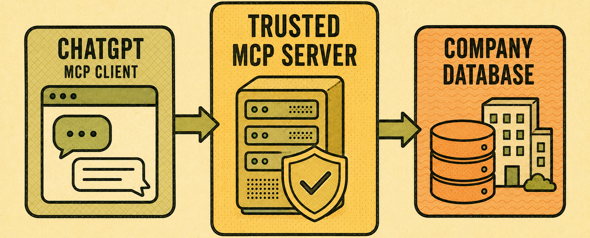
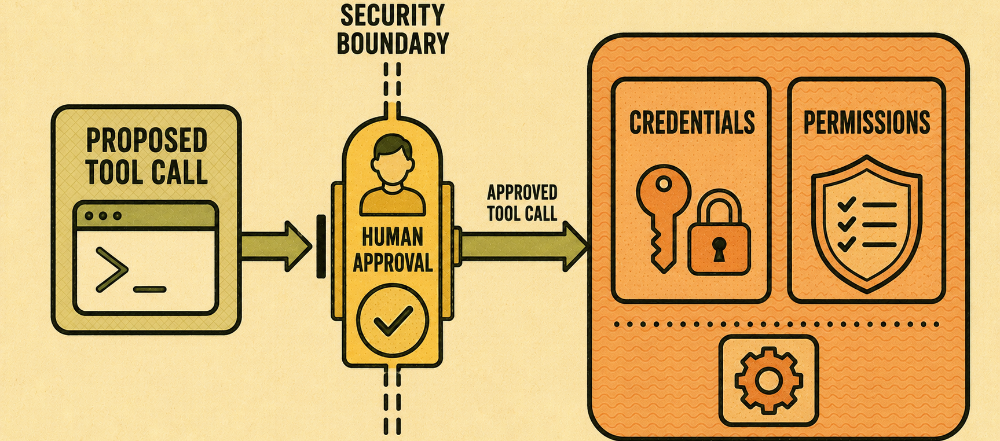
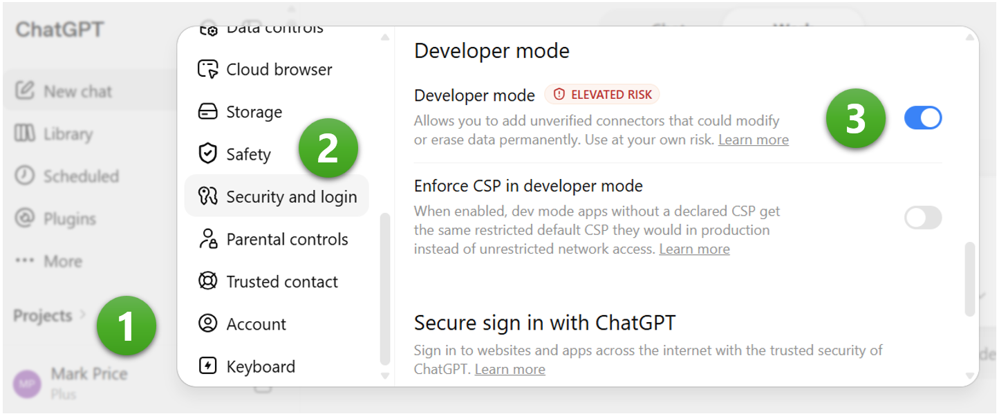
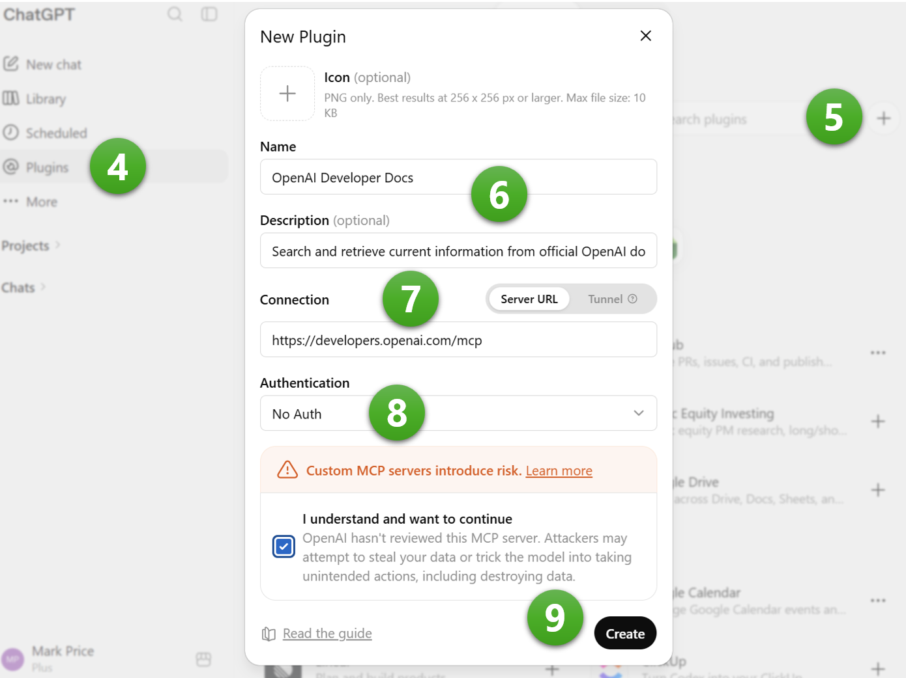
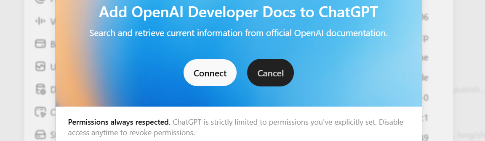
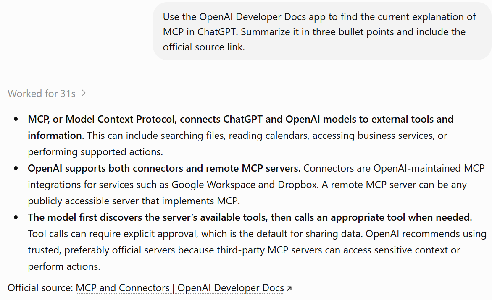
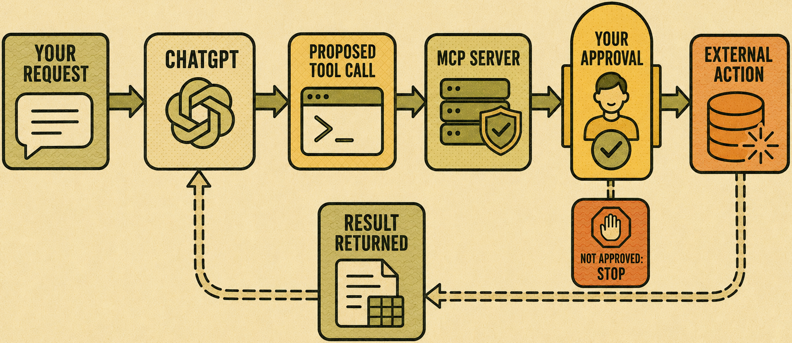

# Chapter 3.9 Connect Trusted Information and Tools with MCP

**Model Context Protocol (MCP)** is a general standard for connecting ChatGPT to information and tools, including ones built inside your own organization.

# Why a standard connection protocol is useful

Before a shared standard existed, every connection between an AI assistant and an outside system needed its own custom work. MCP gives developers one common way to expose their information and actions, so ChatGPT and other AI assistants can connect to many different systems without a separate integration for each one.

You do not need to understand how MCP works behind the scenes. You need to understand what it lets you connect, and how to check that a connection is trustworthy before you use it.

Four terms come up often when working with MCP:
- **MCP Client**: The AI, in this case ChatGPT, that requests information or asks for an action.
- **MCP Server**: The system on the other side of the connection, such as a company database or a project-tracking tool, that offers information and actions through MCP.
- **MCP Tool**: A specific action an MCP server offers, such as creating a task or searching a database.
- **Resource**: Information an MCP server can provide, such as a document or a data record.


*Figure 3.9A: ChatGPT acts as an MCP client, communicating with a trusted MCP server that reaches an external system on your behalf.*

An MCP server can run locally, on your own computer, or remotely, hosted by another organization. A local server is often used for personal tools and files. A remote server is common for company systems and third-party services.

Remote servers usually need an account and explicit approval before ChatGPT can use them. Treat this approval with the same care you would give any new connection to sensitive information.

# Authentication, permissions, and trust

You should only connect to an MCP server you or your organization trusts. A server can request wide-ranging access, so review what it can see and do before approving it, just as you would with a plugin.


*Figure 3.9B: Credentials and permissions sit inside a security boundary. A tool call should not cross it without your approval.*

> **Watch out**: An unfamiliar or unverified MCP server can expose your data to a system you do not control. If your organization has an approved list of MCP servers, use only those. If it does not, ask before connecting one to work data.

Choose an MCP server built for the specific system you need, offered by the organization that owns that system whenever possible. Avoid a server from an unknown source, even if it claims to connect to the same system.

# OpenAI’s Developer Documentation MCP server

The best server for this chapter’s demonstrations is OpenAI’s own public Developer Documentation MCP server: https://developers.openai.com/mcp

It is well suited to a book example because it is:
- Hosted by OpenAI, not an unknown third party.
- Publicly reachable over streamable HTTP.
- Free to use and does not require an API key.
- Read-only, so readers cannot accidentally modify or delete anything.
- Easy to understand: it lets ChatGPT search and retrieve current OpenAI documentation.
- Rich enough to reveal a meaningful list of tools.

OpenAI describes it as a public, documentation-only MCP server that covers `developers.openai.com`, `platform.openai.com`, and `learn.chatgpt.com`. It does not make OpenAI API calls on the reader’s behalf.

> **Learn more online**: Docs MCP:  https://developers.openai.com/learn/docs-mcp.

> **Watch out**: Use ChatGPT on the web. Custom MCP connections are not currently available in the mobile apps.

To configure and authenticate the connection:
1.	Open your account menu and select **Settings**.
2.	In the **Settings** dialog, select **Security and login**.
3.	Switch on **Developer mode**.


*Figure 3.9C: Enabling Developer mode in Settings.*

4.	Open the **Plugins** area in ChatGPT.
5.	Select the **+** button. (This is only visible if you have enabled developer mode.)
6.	Enter something like:
    - Name: OpenAI Developer Docs
    - Description: Search and retrieve current information from official OpenAI documentation.
7.	Under **Connection**, select **Server URL**, and enter the following server address: https://developers.openai.com/mcp
8.	For authentication, select **No Authentication**.

Some MCP servers provide public, read-only information and need no sign-in. Servers that access private information, such as email, documents, source-code repositories, or company systems, should normally require authentication.

9.	Select the **I understand and want to continue** check box and then select the **Create** button.


*Figure 3.9D: Adding an MCP server means entering its address, authenticating, and reviewing what it offers before you rely on it.*

10.	In the Add OpenAI Developer Docs to ChatGPT dialog, select the Connect button:

 
*Figure 3.9E: Connecting OpenAI Developer Docs to ChatGPT.*

In the **Actions** section, review the five tools provided by this MCP server:
1.	`fetch_openai_doc`: Fetch the markdown for a specific doc page.
2.	`get_openapi_spec`: Return the OpenAPI spec for a specific API endpoint URL.
3.	`list_api_endpoints`: List all OpenAI API endpoint URLs available.
4.	`list_openai_docs`: List or browse pages that this server crawls (useful when you don’t know the right query yet or you’re paging through results).
5.	`search_openai_docs`: Search across `platform.openai.com`, `developers.openai.com`, and `learn.chatgpt.com` docs.

These sound technical but remember that ChatGPT will call these tools on your behalf. You can see that connecting an MCP server does not simply give ChatGPT vague “access” to something. The server publishes a specific set of named tools, each with a defined purpose and input structure.

Close Settings.

# Trying out the MCP server

Start a new chat and enter the following prompt:
```
Use the OpenAI Developer Docs app to find the current explanation of MCP in ChatGPT. Summarize it in three bullet points and include the official source link.
```


*Figure 3.9F: A chat response using an MCP server.*

# Inspect available tools and information

Once connected, ask ChatGPT to list the tools and resources the server provides. This confirms the connection works and shows you exactly what it can do before you use it in a real task:
```
List the tools and resources the OpenAI Developer Docs app provides.
```

ChatGPT should tell you that the OpenAI Developer Docs app provides five tools, list them with names and descriptions, and then say its resources cover three main collections:
- OpenAI API and developer documentation, including guides, model documentation, SDK usage, tools, Responses API features, pricing, data controls, and API reference material.
- ChatGPT and Codex documentation from learn.chatgpt.com, including app features, configuration, commands, integrations, plugins, MCP, scheduled tasks, and developer workflows.
- OpenAPI endpoint specifications, including endpoint schemas, request and response fields, and language-specific code samples.


*Figure 3.5G: A request becomes a tool call, an external action, and a result, with your approval sitting between the action and anything consequential.*

# Test safely and handle failures

Test a new MCP connection with a low-risk request first, such as reading information rather than changing it. If the server fails or returns an error, do not repeat the request blindly. Check the error message and confirm the server is still trusted and available before trying again.

> **Good practice**: Keep a short record of which MCP servers you have connected and why. This makes it easy to review your connections later and remove any that are no longer needed.

# Try it now

If your organization has an approved MCP server, connect it and ask ChatGPT to list its available tools and resources. If not, read the settings screen where a connection would be added, and note what information it would ask you to review.

## Check the result
- Can you name the server you connected, or would connect, and who built it?
- Did you review the tools and resources it offers before treating it as trustworthy?
- Do you know what to do if a request to the server fails?
