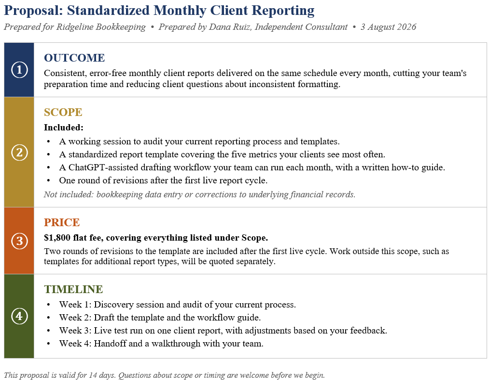
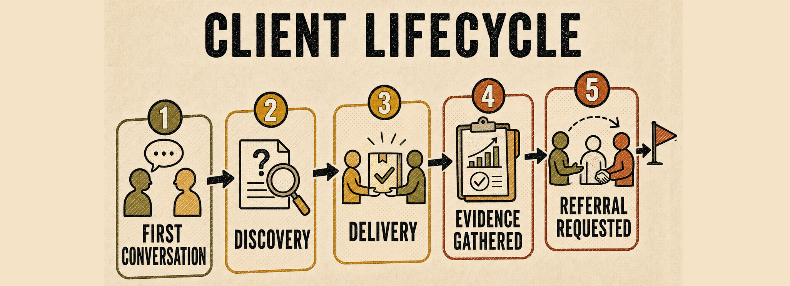

# Chapter 4.12 Find Customers and Deliver Responsibly

This chapter takes your offer to real customers and shows you how to deliver on your promise in a way that protects both them and you.

# Use an existing network

Your first customers are more likely to come from people who already know and trust you than from strangers. Start with your existing network: colleagues, former clients, and people you have helped informally in the past.
1.	List people who might need your offer or know someone who does.
2.	Reach out with a short, specific message describing the problem you solve, not a general pitch.
3.	Ask directly whether they, or someone they know, might be interested.
4.	Follow up respectfully if you do not hear back right away.

# Conduct discovery

Before starting any paid work, have a short conversation with the prospective customer to confirm their actual need matches your offer. Chapter 1.7's approach to gathering information before recommending a decision applies here as well.
1.	Ask about their specific situation and what they have already tried.
2.	Confirm your offer's scope actually fits what they need.
3.	Note anything outside your defined scope, and say so clearly.
4.	Decide together whether to proceed.

> **Watch out**: Do not stretch your offer's scope to close a deal that does not quite fit. A mismatched engagement often costs more in frustration and reputation than the value of the deal itself.

# Write a proposal

Turn your discovery conversation into a short, clear proposal covering the outcome, the scope, the price, and the timeline. Use ChatGPT to help you draft it quickly, then review every detail against what you actually discussed and agreed.

The proposal must include:
1.	Outcome: the specific result the customer gets, described in terms that matter to them.
2.	Scope: exactly what is included, stated plainly enough to avoid confusion later.
3.	Price: reflects the value delivered and the effort required.
4.	Timeline: be honest with yourself about the actual cost in your time.

> **Sample files**: A one-page Word short proposal: https://github.com/markjprice/chatgpt-vb/tree/main/Files/Book4/4-12-Proposal.docx. It uses the small accounting firm’s customer example from *Chapter 4.10*'s offer-canvas discussion, so the proposal reads as the direct output of that earlier exercise. Outcome, scope, price, and timeline are all filled in with realistic, specific details.

*Figure 4.12A: A clear proposal states the outcome, the scope, the price, and the timeline, so both sides start with the same expectations.*

# Use a documented delivery workflow

Deliver your offer using the workflow habits from Book 3: a defined process, checkpoints, and review before anything reaches the customer. A documented, repeatable delivery process protects your quality and your time as you take on more customers.

# Protect customer information

Treat customer information with the same care described in *Chapter 2.1*. Only use data the customer has given you permission to use, store it securely, and never share one customer's information with another.

> **Real-world example**: A freelance writer building content for two competing companies keeps each client's material in a separate Project, never referencing one client's strategy or figures when working on the other's material, even informally in conversation.

# Handle revisions

State your revision policy clearly before starting work, including how many rounds are included and what counts as a change within scope versus new work. When a revision request falls outside the agreed scope, say so directly and offer to handle it as additional work.

 
*Figure 4.12B: A client lifecycle moves from a first conversation through discovery and delivery to evidence and, when appropriate, a referral.*

# Request referrals

After a successful engagement, ask your customer directly whether they know anyone else who might benefit from your offer. Most satisfied customers are willing to help if asked, but few will offer a referral without being asked.

> **Good practice**: Ask for a referral close to the moment the customer is most satisfied with your work, such as right after a successful delivery, rather than waiting weeks and hoping they remember to mention you.

# Maintain products

If your offer includes a reusable product, plan for ongoing maintenance: keeping it accurate as circumstances change, fixing problems customers report, and updating it as your own methods improve.

# Try it now

List three people in your existing network who might need your offer or know someone who does. Draft a short outreach message for one of them, focused on the problem you solve.

## Check the result
- Does your outreach message describe a specific problem, rather than a general pitch?
- Do you have a clear revision policy ready before you start any paid work?
- Have you planned how you will protect each customer's information separately from others?
