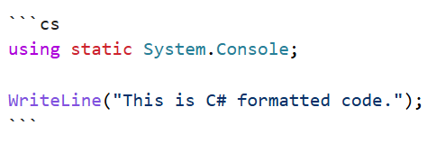

# Getting help on Discord and other chat forums

A useful question tells people what you tried, what happened, and what you expected. 

Here are some tips for asking questions to get help:

- **Ask in a public channel, not in private**: Please do not direct message an author with a question or to make a friend or connection request. Every question asked and answered in public builds the collective knowledge and resourcefulness of the whole community. Asking in public also allows other readers to help you, not just the author. The community that Packt and I have built around my books is friendly and smart. Let us *all* help you.
- **Research before asking**: It’s important to look for answers yourself before turning to the community. Use an AI, search engines, official documentation, and the search function within the forum or Discord server. You may solve the problem yourself, and you avoid asking others to repeat an answer that already exists. Another place to look first is the changes section of the book: https://github.com/markjprice/claude-vb/blob/main/docs/changes.md.
- **Be polite and patient**: Remember, you’re asking for help from people who are giving their time voluntarily. A polite tone and patience while waiting for a response go a long way. Channel participants are often in a different time zone, so you may not see your question answered until the next day.
- **Be specific and concise**: Clearly state what you’re trying to achieve, what you’ve tried so far, and where you’re stuck. A concise question is more likely to get a quick response.
- **Give the book location**: If you are stuck on a particular part of the book, specify the section title (this is most useful) and the page number (for PDF or paperback) or location (for Kindle) so that others can look up the context of your question.
- **Show your work**: Demonstrating that you’ve made an effort to solve the problem yourself not only provides context but also helps others understand your thought process and where you might have gone down the wrong path.
- **Prepare your question**: Avoid too broad or vague questions. Screenshots of errors or code snippets (with proper formatting) can be very helpful. Oddly, some readers take photos of their screen and post them. These are hard to read and limited in what they can show. It’s better to copy and paste the text of your code or the error message so that others can copy and paste it themselves. Alternatively, at least take a screenshot instead.

> **Prompt**: Please explain why screenshots of code are less useful than pasted text when asking for help. Show a good Markdown-formatted example of a C# question.

- **Format your code properly**: Most forums and Discord servers support code formatting using Markdown syntax. Use formatting to make your code more readable. For example, surround code keywords in single backticks, like `public void`, and surround code blocks with three backticks with optional language code like `cs` for C#:

> **Good practice**: After the three backticks that start a code block in Markdown, specify a language short name like cs, csharp, js, javascript, json, html, css, cpp, xml, mermaid, python, java, ruby, go, sql, bash, or shell. To learn how to format text in Discord channel messages, see the following link: https://support.discord.com/hc/en-us/articles/210298617-Markdown-Text-101-Chat-Formatting-Bold-Italic-Underline.

- **Be ready to actively participate**: After asking your question, stay engaged. You might receive follow-up questions for clarification. Responding promptly and clearly can significantly increase your chances of getting a helpful answer. When I ask a question, I set an alarm for three hours later to go back and see if anyone has responded. If there hasn’t been a response yet, then I set another alarm for 24 hours later.

Incorporating these approaches when asking questions not only increases your likelihood of getting a useful response but also contributes positively to the community by showing respect for others’ time and effort.

> **Good practice**: Never just say “Hello” as a message on a chat system or message board: https://nohello.net/. Similarly, don’t ask to ask: https://dontasktoask.com/.
